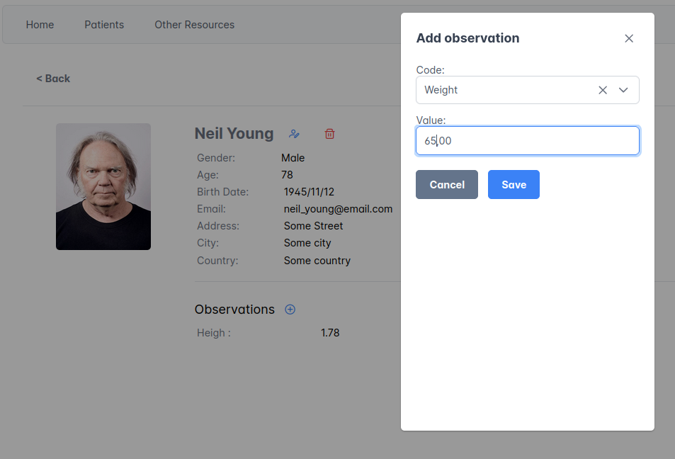

<h1 align="center">
  <br>
  
  <br>
  Demo fhir App
  <br>
</h1>

<h4 align="center">Demo app for use with FHIR standards, built with Angular</h4>

<p align="center">
  <a href="#features">Features</a> •
  <a href="#FHIR">FHIR</a> •
  <a href="#instalação">Instalação</a> •
  <a href="#projeto">Projeto</a> •
  <a href="#créditos">Créditos</a>
</p>

<div align="center">
  
</div>


## Features

* Gerenciamento de Pacientes
  - Adicione pacientes e gerencie suas informações
* Interoperabilidade com FHIR
  - Compatibilidade com padronização FHIR (fhir r4)
* Mock Data
  - Dados mock para testes
* Language: English

## FHIR

🚧 (O que é FHIR, documentação, implementações)

## Instalação

Pré-requesitos
- [Java SDK 17+](https://openjdk.org/projects/jdk/17/)
- [Maven](https://maven.apache.org/)
- [Node.js](https://nodejs.org)  

Servidor FHIR

```bash
# Clone o repositório da implementação HAPI - FHIR
$ git clone https://github.com/hapifhir/hapi-fhir-jpaserver-starter

# Vá para a pasta do servidor
$ cd hapi-fhir-jpaserver-starter

# Instale e execute (a instalação pode demorar alguns minutos)
$ mvn spring-boot:run
```

Angular App

```bash
# Clone este repositório
$ git clone https://github.com/juhachmann/demo-fhir-app

# Vá para a pasta do repositório
$ cd demo-fhir-app

# Instale e execute (a instalação pode demorar alguns minutos)
$ npm install --legacy-peer-deps

# Em seu navegador, acesse localhost:4200
```

## Projeto

🚧 (abordagem, mapping domain data X fhir std)

## Créditos

This software uses the following Open Source packages:

- [HAPI FHIR JPA Server Starter](https://hapifhir.io/hapi-fhir/docs/server_jpa/introduction.html)
- [@types/fhir](https://www.npmjs.com/package/@types/fhir)
- [PrimeNG](https://primeng.org/)
- [PrimeFlex](https://primeflex.org/)


Agradecimentos

- GECAD / Rafael

